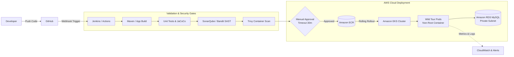

# Pruthvi Raj D S

<p align="left">
  <strong>DevOps & Cloud Engineer | Platform Engineering & Infrastructure Automation</strong><br>
  Bengaluru, India &bull; Cloud Computing & DevOps Intern @ Rooman Technologies &bull; CNCF Open Source Contributor
</p>

<p align="left">
  <a href="https://www.linkedin.com/in/pruthvirajds"></a>
  <a href="https://pruthvi-lyart.vercel.app"></a>
  <a href="mailto:pruthviraj462004@gmail.com"></a>
  <a href="https://github.com/2004Pruthvi"></a>
</p>

---

## 📌 Executive Summary

I am a **DevOps and Cloud Engineer** specializing in designing and implementing resilient, secure, and automated cloud delivery systems. My background spans building multi-stage **CI/CD pipelines** with Jenkins and GitHub Actions, provisioning infrastructure with **Terraform**, managing server configuration with **Ansible**, and orchestrating container workloads on **AWS (EKS, ECR, EC2, RDS, VPC)**.

I believe in **immutable infrastructure**, **least-privilege security**, **automated quality gates (SAST, SCA, container scanning)**, and practical observability. In addition to personal and academic projects, I actively contribute to the **CNCF ecosystem** via the Layer5 and Meshery open-source communities.

---

## 🛠️ Technical Competencies

```
┌─────────────────────────┬─────────────────────────────────────────────────────────────┐
│ Domain                  │ Technologies & Tooling                                      │
├─────────────────────────┼─────────────────────────────────────────────────────────────┤
│ Cloud Platforms         │ AWS (EKS, ECR, EC2, VPC, ALB, ASG, RDS MySQL, IAM, S3, CW)  │
│ Containers & K8s        │ Docker, Multi-stage builds, Non-root images, Kubernetes     │
│ CI/CD & Automation      │ Jenkins (Declarative pipelines), GitHub Actions, Maven      │
│ Infrastructure as Code  │ Terraform (AWS VPC/Compute/RDS), Ansible (Playbooks, Roles) │
│ DevSecOps & Quality     │ Trivy, SonarQube, Bandit, Flake8, Secret Management         │
│ Scripting & Programming │ Bash / Linux Shell, Python, Java (Enterprise Servlet/WAR)   │
│ Systems & Networking    │ Linux (Ubuntu/Debian), TCP/IP, DNS, VPC Subnetting, Routing  │
│ Open Source Ecosystem   │ Git, GitHub, Layer5 / Meshery (CNCF Cloud Native Manager)   │
└─────────────────────────┴─────────────────────────────────────────────────────────────┘
```

---

## 🚀 Featured Engineering Projects

### 1. [Wild Tour DevSecOps Platform](https://github.com/2004Pruthvi/End-to-End-Tourism-Package-Management-Cloud-Native-DevSecOps-Project)
> **Production-Style Cloud-Native DevSecOps Pipeline & AWS EKS Orchestration**

* **Architecture:** Enterprise Java web application containerized with Tomcat 10 (JDK 17 Temurin) as a non-root container, deployed onto Amazon EKS with AWS RDS MySQL backing.
* **CI/CD Pipeline:** Multi-stage declarative Jenkinsfile featuring automated Maven builds, JUnit test reporting, JaCoCo code coverage publishing, Docker image creation, manual production approval gates with timeouts, ECR digest verification, zero-downtime rolling updates to Amazon EKS, and automated failure/success email alerts.
* **Infrastructure as Code:** Complete AWS VPC architecture provisioned in Terraform (public & private subnets, internet gateway, route table associations, security groups enforcing strict least-privilege database ingress, EC2, and Amazon RDS MySQL).
* **Configuration Management:** Ansible roles and playbooks managing application prerequisites and baseline configurations.
* **Kubernetes Manifests:** Namespace isolation (`wild-tour`), ConfigMaps for database endpoints, Secrets for DB credentials, Deployment with CPU/Memory limits, and readiness probes.
* **Tech:** `AWS EKS` &bull; `Terraform` &bull; `Jenkins` &bull; `Docker` &bull; `Ansible` &bull; `AWS ECR` &bull; `AWS RDS` &bull; `Kubernetes`

---

### 2. [AWS High-Availability Scalable Web Architecture](https://github.com/2004Pruthvi/aws-devops-scalable-architecture)
> **Fault-Tolerant, Multi-AZ Compute Architecture with Dynamic Elastic Scaling**

* **Architecture:** Multi-instance web tier deployed across AWS availability zones behind an Application Load Balancer (ALB) with intelligent health checking and path-based routing.
* **Automation:** Auto Scaling Groups (ASG) configured with custom launch templates and dynamic CloudWatch target-tracking policies to handle traffic spikes and eliminate single points of failure.
* **Reliability:** Built-in self-healing instances with target group health probes, automated failure isolation, and EBS snapshot backup workflows.
* **Tech:** `AWS EC2` &bull; `Application Load Balancer` &bull; `Auto Scaling Groups` &bull; `CloudWatch` &bull; `VPC`

---

### 3. [Enterprise DevSecOps CI/CD Pipeline](https://github.com/2004Pruthvi/enterprise-devops-project)
> **Automated Code Quality, Artifact Governance & Container Vulnerability Scanning**

* **Quality & Security Gates:** Automated Maven build executing unit testing, SonarQube static code analysis (SAST), artifact publication to Sonatype Nexus, and automated container vulnerability scanning with Trivy.
* **Container Lifecycle:** Docker container build and packaging enforcing zero-CVE standards before staging promotion.
* **Tech:** `Jenkins` &bull; `SonarQube` &bull; `Trivy` &bull; `Nexus` &bull; `Docker` &bull; `Maven` &bull; `Linux`

---

### 4. [Automated Python CI Pipeline with Security SAST](https://github.com/2004Pruthvi/Test_CI)
> **GitHub Actions Pipeline Enforcing Code Quality, SAST Scanning & Test Coverage Thresholds**

* **Pipeline Stages:** Automated triggers on push/PR running Flake8 linting, Bandit security vulnerability analysis, and Pytest with a mandatory 80% coverage threshold (`--cov-fail-under=80`).
* **Environment Governance:** Automated gating to simulated staging deployment upon passing all quality checks.
* **Tech:** `GitHub Actions` &bull; `Python 3.11` &bull; `Bandit SAST` &bull; `Flake8` &bull; `Pytest-Cov`

---

## 🌐 Open Source Contributions

I believe contributing to upstream open-source projects is the best way to develop real-world platform engineering discipline.

| Project / Repository | Pull Request | Contribution Summary | Status |
|:---|:---|:---|:---:|
| [meshery-extensions / meshery-cilium](https://github.com/meshery-extensions/meshery-cilium) | [PR #196](https://github.com/meshery-extensions/meshery-cilium/pull/196) | Migrated linter configuration to `golangci-lint v2` and modernized static analysis rules | `Under Review` |
| [meshery-extensions / meshery-cilium](https://github.com/meshery-extensions/meshery-cilium) | [PR #195](https://github.com/meshery-extensions/meshery-cilium/pull/195) | Corrected branch target specification for Meshery repository checkout in E2E testing workflows | `Under Review` |
| [layer5io / layer5](https://github.com/layer5io/layer5) | [PR #7506](https://github.com/layer5io/layer5/pull/7506) | Fixed visual scrollbar overflow regressions across categories and tags navigation widgets | `Merged` ✅ |
| [meshery / meshery](https://github.com/meshery/meshery) | [PR #17955](https://github.com/meshery/meshery/pull/17955) | Community onboarding, documentation verification, and newcomers meeting proceedings | `Merged` ✅ |

---

## 🔄 CI/CD & Delivery Workflow



---

## 🎯 2026 Engineering Roadmap

* **Advanced Kubernetes Orchestration:** Helm chart packaging, ingress controller routing (Traefik/Nginx), and custom NetworkPolicies.
* **GitOps Implementation:** Migrating continuous deployment pipelines to ArgoCD for declarative state synchronization.
* **Service Mesh & Networking:** Deepening hands-on implementation with Cilium eBPF and Istio service mesh patterns.
* **Secrets Governance:** Integrating external secrets management (HashiCorp Vault / AWS Secrets Manager) via External Secrets Operator.

---

## 📬 Let's Connect

* **Portfolio:** [pruthvi-lyart.vercel.app](https://pruthvi-lyart.vercel.app)
* **LinkedIn:** [linkedin.com/in/pruthvirajds](https://www.linkedin.com/in/pruthvirajds)
* **Email:** [pruthviraj462004@gmail.com](mailto:pruthviraj462004@gmail.com)
* **Location:** Bengaluru, India
